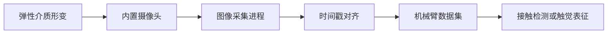

<!-- Generated by the offline translation workflow.
Source: 03-机器人硬件、lerobot及地瓜RDK-X5开发板控制教程/补充待完善019DTact.md
Source SHA-256: d0456a74556f1007e6accd522055d0d98ca8475d0227d672b2f95bfdaba0c87f
Model: tencent/Hy-MT2-1.8B-GGUF:Q4_K_M
Review machine-translated technical claims before relying on them.
-->
# DTact Visual and Tactile Sensor Integration

DTact observes the deformation of the elastic medium through the camera, converting the contact process into a saveable and synchronized image sequence. This type of sensor is suitable for detecting initial contact, slip, clamping stability, and local geometry of objects. This section provides an access method compatible with robotic arm data collection, without relying on a specific model.

## Data Chain



Tactile images should not be saved separately. Each frame of the image must have the following information aligned:

- Monotonically increasing timestamp;
- Position of robotic arm joints and gripper opening;
- Task, turn, and frame indices;
- Force, torque, or current estimates, if available.

## Environment Preparation

If the collection program uses ROS, install the workspace and dependency management tools first:

```bash
sudo apt update
sudo apt install -y \
  python3-rosdep \
  python3-rosinstall \
  python3-rosinstall-generator \
  python3-wstool \
  build-essential
```

These packages are only responsible for building and parsing the ROS workspace, and do not include the device drivers for DTact. It is also necessary to install V4L2 drivers or those provided by the manufacturer according to the actual camera model.

## Equipment Inspection

After connecting the sensor, first confirm that the system can enumerate video devices:

```bash
v4l2-ctl --list-devices
```

After selecting the device node, read the resolution and frame rate it supports:

```bash
export TACTILE_DEVICE=/dev/video2
v4l2-ctl --device "$TACTILE_DEVICE" --list-formats-ext
```

**Checkpoint 1:** The name of the video device, device node, and supported image format should be consistent with the physical device. If the device number changes after restarting, use the `udev` rule to create a stable device name, rather than hardcoding `/dev/video2` in the collection program.

## Calibration and Synchronization

1. Capture a background image in a non-contact state to represent the initial appearance of the elastic medium.
2. Apply repeatable contact at multiple positions using a pressure head of known shape, and check whether the imaging brightness, field of view, and deformation direction are stable.
3. Record a monotonic clock during the acquisition procedure, using the same time reference as the joint state.
4. Perform a slow closing gripper experiment before the full round to verify whether the tactile image changes are synchronized with the gripper opening changes.

**Checkpoint 2:** During contact, the tactile image should exhibit continuous deformation, and the aligned joint state should not show systematic delay for more than a few frames.

## Dataset Interface

In the LeRobot dataset, tactile images can be defined as independent observation keys, such as `observation.images.tactile_left` and `observation.images.tactile_right`. Visual and tactile perception are both image streams, but their meanings differ: ordinary cameras describe the environment, while tactile cameras describe the contact interface. Before training, their image statistics should be calculated separately without sharing a common set of image normalization parameters.

## Common Questions

- **Image flickering or color drift:** Keep exposure, gain, and white balance constant to avoid changes in auto-imaging parameters that affect the features.
- **Image is normal but not synchronized with motion:** First compare the capture timestamps, then examine the video buffer and encoding queue; do not align solely based on the save completion time.
- **Too small deformation area during rigid contact:** Check the hardness of the elastic medium, lens focal length, and lighting structure; do not compensate for imaging issues by increasing clamping force.

For the system selection method of sensors, refer to [. For sensor selection and data acquisition, refer to ](06-sensor-selection-and-data-acquisition.md).
