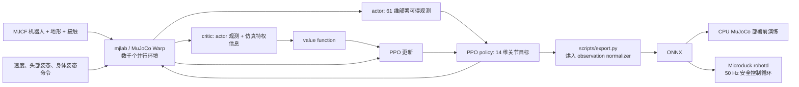

<!-- Generated by the offline translation workflow.
Source: 05-具身场景的深度和强化学习/05-OpenDuckMini与Microduck双足强化学习/README.md
Source SHA-256: 88853406c374e1298a057923c1feaf266bf4f7e47b6d2b80b23372f16d144afa
Model: tencent/Hy-MT2-1.8B-GGUF:Q4_K_M
Review machine-translated technical claims before relying on them.
-->
# Open Duck Mini and Microduck: Walking from URDF Model to Dual-Body Reinforcement Learning

This section breaks down two generations of open-source bipedal robots named “Little Ducks”: [Open Duck Mini v2](https://github.com/apirrone/Open_Duck_Mini/tree/v2) and [Microduck](https://github.com/pollen-robotics/microduck). We do not consider them as two scripts in the same repository, but rather examine the entire chain: where the robot description files are downloaded, how the reinforcement learning environment is assembled, how PPO learns speed tracking, and why the checkpoint must go through the official export script to become an ONNX policy usable on a real robot.

After completing this section, everyone should be able to:

- Define the responsibility boundaries for the four projects: Open Duck Mini v2, Open Duck Playground, Microduck, and Microduck RL;
- Only download the URDF of Open Duck Mini v2 and its STL mesh, and verify that the assets are complete;
- Run the smoke test for `64 个环境 x 5 次迭代` on Microduck RL before starting the formal training;
- Play back the policy, record simulation videos, export ONNX with normalized observations, and conduct pre-deployment testing in CPU MuJoCo;
- Determine what additional engineering steps are needed for a policy that “moves in simulation” to achieve stable 50 Hz movement on a real robot.

## 1. First, clarify the four items

The “Open Duck” project has gone through multiple iterations in mechanical design, reference action generation, MuJoCo reinforcement learning, and operation on the new generation real robot. The names are similar, but the file formats and commands cannot be mixed together.

| Item | Role | Robot Description | How to Use During Learning |
| :-- | :-- | :-- | :-- |
| [Open Duck Mini v2](https://github.com/apirrone/Open_Duck_Mini/tree/v2) | An open-source mechanical and embedded resource center measuring about 42 cm | `robot.urdf` and `robot.xml`, STL files are saved in the same directory | Learn URDF, mechanical structure, and early sim-to-real |
| [Open Duck Reference Motion Generator](https://github.com/apirrone/Open_Duck_reference_motion_generator) | Generates gait reference motions using Placo | Contains URDF and mesh files for multiple generations of Duck | Generates `polynomial_coefficients.pkl` for imitation rewards |
| [Open Duck Playground](https://github.com/apirrone/Open_Duck_Playground) | The MuJoCo Playground/JAX training pipeline for Open Duck Mini v2 | Uses MJCF from the repository | Reproduction of the walking policy of older models |
| [Microduck RL](https://github.com/pollen-robotics/microduck_rl) + [Microduck](https://github.com/pollen-robotics/microduck) | Training and real robot versions of a new generation duck measuring about 25 cm and weighing 800 g | The training pipeline uses MJCF; no URDF as the entry point | Learn the complete chain from `mjlab + MuJoCo Warp + PPO + ONNX + 50 Hz runtime` |

> **Key judgment:** If your goal is to “download the URDF for mechanical structure research,” start with Open Duck Mini v2; if you aim to “run the current official reinforcement learning training,” start with Microduck RL. Directly replacing the URDF of Open Duck Mini v2 into Microduck RL will not succeed automatically, as the joint names, degrees of freedom, component masses, collision bodies, and observation/action contracts for the policy are different.

## II. Establish an intuitive understanding of the official effect first

<p align="center">
  
</p>

**Figure 1: Overview of the Microduck RL official project.** The new generation of projects does not train a single walking policy, but incorporates tasks such as speed tracking, standing up, sitting, grasping, kicking the ball, forward roll, and skating into a shared task registry. They share a 61-dimensional actor observation and 14-dimensional action contract, allowing the real robot to switch between walking, standing, and skill policies during operation.

<p align="center"><sub> Source: The top image on the `microduck_rl` repository README page by Pollen Robotics. The original project was released under the Apache-2.0 license. </sub></p>

<video controls muted playsinline preload="metadata" width="100%">
  <source src="../../../05-具身场景的深度和强化学习/05-OpenDuckMini与Microduck双足强化学习/assets/official_videos/microduck_real_walking.mp4" type="video/mp4">
</video>

**Video 1: Microduck real robot walking clip.** This material is from the real robot demonstration on the Microduck RL official project page. The tutorial extracted the first 20 seconds and converted it into a H.264 MP4 format that is easier to play in a browser. This shows the effects of the official policy, not the result of this tutorial being retrained locally.

<video controls muted playsinline preload="metadata" width="100%">
  <source src="../../../05-具身场景的深度和强化学习/05-OpenDuckMini与Microduck双足强化学习/assets/official_videos/open_duck_mini_v2_sim_walking.mp4" type="video/mp4">
</video>

**Video 2: Official simulation of Open Duck Mini v2 walking.** This video is from the “Turning MuJoCo Playground” section of the Open Duck Mini v2 project. It corresponds to the older 42 cm robot, but not to the 14-degree-of-freedom policy contract of the new Microduck.

## III. The Complete Training Process from the Architecture Diagram



**Figure 2: Data flow of Microduck RL.** This architecture consists of five essential modules that cannot be skipped.

### 1. Robot and actuator models

The main MJCF of Microduck RL is located at:

```text
src/mjlab_microduck/robot/microduck/
├── robot_walk.xml
├── robot_allcollisions.xml
├── robot_allcollisions_rollers.xml
├── robot_*_backlash.xml
└── scene*.xml
```

`robot_walk.xml` is used for speed tracking, reducing unnecessary contact between the torso and head; `robot_allcollisions.xml` retains body collisions for standing up, sitting, grasping, and forward roll; the rollers version adds non-driven wheels on the soles of the feet. In training, the motor is not treated as an ideal PD actuator, but instead a [BAM](https://github.com/Rhoban/bam) Dynamixel XL330 actuator model is used, incorporating factors such as back EMF, Coulomb/static friction, load-related friction, and battery voltage.

### 2. Observation, Command, and Action Contracts

The actor input for the new policy has 61 dimensions, and the output is a 14-dimensional joint action. The command slots are fixed as follows:

```text
twist 速度命令 3 维
+ head pose 命令 4 维
+ body pose 命令 6 维
= 13 维命令子向量
```

The remaining observations come from the IMU, joint positions/speed, and historical actions. The actor does not use the base linear velocity that is difficult to obtain reliably with a real robot; the critic can additionally access this simulation true value during training. This is a typical asymmetric actor-critic architecture: the value network uses more complete information to accelerate learning, while the policy network remains viable for deployment.

### 3. Rewards are not a single "move forward" item

Rewards and constraints for the main task `Mjlab-Velocity-Flat-MicroDuck` can be roughly divided into:

| Category | Representative Item | Function |
| :-- | :-- | :-- |
| Task Reward | linear/angular velocity tracking | Track `vx, vy, yaw rate` command |
| Posture Reward | upright, pose, head pose tracking | Avoid tipping over for speed while maintaining head control |
| Gait Reward | air time, foot clearance, swing height | Encourage feet to truly leave the ground and prevent sliding on the ground |
| Smoothness and Safety | action rate, self collision, foot slip | Suppress high-frequency jitter, self-collision, and excessive foot slipping |
| Curriculum Learning | standing fraction, head-pose range, reward weight | First learn the basic gait, then gradually increase the command range and intensity |

What is most worth learning here is not a specific weight, but the competition among reward items. For example, the foot-slip penalty is too heavy, which suppresses the pivot motion required for the small robot to turn in place; the action-rate is too high from the first step, forcing the robot to stay still before it even learns how to walk. Therefore, the official configuration uses a curriculum approach, allowing smooth constraints and a wider command range to be introduced gradually in later stages.

### 4. Four-layer protection for Sim-to-real

Microduck RL does not rely on a perfectly accurate simulator, but it does four things simultaneously:

1. Use BAM to reduce the gap between the ideal motor and the small servo actuator;
2. Perform domain randomization on mass/inertia, center of mass, friction, voltage, IMU installation deviation, encoder zero offset, and action latency;
3. Provide a `Backlash` task variant that simulates gear backlash using a driven-free passive joint;
4. Before the real robot, reenact the same observation/action contract and policy switching as in runtime using `infer_policy.py`.

## IV. Recommended Main Line: Train the New Microduck Walking Policy

### 0. Environmental Prerequisites

Official project requirements:

- Linux x86_64 or officially adapted Linux ARM environment;
- NVIDIA CUDA GPU, training executed via MuJoCo Warp;
- Python `>=3.12,<3.13`, created by `uv` according to `uv.lock`;
- For formal training,Weights & Biases is used by default to save experiments and checkpoints.

First, check the GPU and basic tools:

```bash
nvidia-smi
git --version
curl --version
```

### 1. Clone and Install

Working directory: Any Linux workspace without spaces.

```bash
curl -LsSf https://astral.sh/uv/install.sh | sh
source "$HOME/.local/bin/env"

git clone https://github.com/pollen-robotics/microduck_rl.git
cd microduck_rl
uv sync

# 正式训练前登录 W&B，用于记录曲线和 checkpoint
uv run wandb login
```

When downloading the CUDA wheel for ARM devices such as DGX Spark/GB10 or Jetson for the first time, the official recommendation is to increase the `uv` timeout:

```bash
export UV_HTTP_TIMEOUT=600
uv sync
```

**Checkpoint 1:** Do not train immediately. First, verify that the task registry and CPU unit tests are functioning properly.

```bash
uv run list-envs | grep MicroDuck
uv run --with pytest pytest tests/
```

Seeing tasks such as `Mjlab-Velocity-Flat-MicroDuck` and successful testing only proves that dependencies, registry, and configuration constraints are available, but it does not mean that GPU training can operate stably for a long time.

### 2. Five essential iterations of smoke test

The official maintainer explicitly suggested in `AGENTS.md` to run 64 parallel environments and perform 5 PPO iterations before long training:

```bash
uv run train Mjlab-Velocity-Flat-MicroDuck \
  --env.scene.num-envs 64 \
  --agent.max_iterations 5
```

**Checkpoint 2:** What this small test aims to prove is:

- MuJoCo Warp can create a parallel environment on CUDA;
- The actor observation and action dimensions are consistent with the model;
- Each reward/termination/event can be processed once;
- Rollout does not produce NaN within a few steps;
- Checkpoints can be written into the `logs/` directory.

It does not prove that the policy has learned to walk. It is normal for the actions during 5 iterations to remain close to randomness.

### 3. Formal Training

```bash
uv run train Mjlab-Velocity-Flat-MicroDuck \
  --env.scene.num-envs 4096
```

The experience provided in the official README is that an available gait can be seen in about 1–2 hours in a 4096 environment. However, the actual convergence time is affected by the GPU, current configuration, random seed, and curriculum. Do not treat this number as a hard guarantee.

At least the following should be monitored during a normal training:

| Metric | What to Look At | Common Misjudgments |
| :-- | :-- | :-- |
| mean reward | Long-term trend is upward, not every iteration | Only focusing on total reward, ignoring how the policy exploits rewards |
| episode length | Interpreted together with the current curriculum stage and fall rate | The longer, the better |
| velocity tracking | Both linear and angular velocities improve | Thinking that moving forward is sufficient to master turning |
| penalty terms | The weighted penalty should be non-positive | The sign is reversed; the policy scores by self-collision and other behaviors |
| Motion and posture videos | Whether it scratches the ground, jumps with the buttocks, presses the head against the ground, or high-frequency shaking | Only looking at the curve, ignoring physical behavior |

The official command form for recovery after interruption is:

```bash
uv run train Mjlab-Velocity-Flat-MicroDuck \
  --env.scene.num-envs 4096 \
  --agent.run-name resume \
  --agent.load-checkpoint model_29999.pt \
  --agent.resume True
```

### 4. Playback and recording walking videos

The official quickstart uses the W&B run path to locate the checkpoint:

```bash
uv run play Mjlab-Velocity-Flat-MicroDuck \
  --wandb-run-path <entity/project/run_id>
```

If the video needs to be retained, the export script itself provides `--video`, `--video-length`, `--video-width`, and `--video-height` parameters:

```bash
uv run scripts/export.py Mjlab-Velocity-Flat-MicroDuck \
  --wandb-run-path <entity/project/run_id> \
  --video \
  --video-length 600 \
  --video-width 1280 \
  --video-height 720 \
  --onnx-file output.onnx
```

The video will be written in the `videos/play/` under the checkpoint log directory. It is evidence of the physical behavior of the gait, and cannot be replaced by a total reward curve.

### 5. Export ONNX and CPU MuJoCo experiments

```bash
uv run scripts/export.py Mjlab-Velocity-Flat-MicroDuck \
  --wandb-run-path <entity/project/run_id> \
  --onnx-file output.onnx

uv run scripts/infer_policy.py --walking output.onnx
```

`scripts/export.py` is not just about changing the suffix of the PyTorch network. It also incorporates the observation normalizer used during training into the ONNX computation graph. Manual conversion of checkpoints may fail completely during deployment due to unnormalized inputs, even if the dimensions match.

`infer_policy.py` supports keyboard speed commands, and can also load policies such as walking, standing, sit-stand, and roulade simultaneously:

```bash
uv run scripts/infer_policy.py \
  --walking walk.onnx \
  --standing stand.onnx \
  --sitstand sitstand.onnx \
  --roulade roulade.onnx \
  --new-cmd-obs
```

This step requires checking three things: whether the ONNX input/output is `[1,61] -> [1,14]`, whether the command slots match the runtime, and whether there is a sudden posture change during policy switching.

### 6. Real robot deployment boundaries

The `robotd` in the Microduck real robot repository runs at 50 Hz, reads the IMU and servo states, generates a 61-dimensional observation, calls the ONNX policy, and converts the 14-dimensional action into joint targets. However, there must still be a connection from `output.onnx` to the real robot:

- Joint order, orientation, zero position, and limit check;
- IMU coordinate system and installation deviation calibration;
- Disconnection, overheating, fall, abnormal motion amplitude, and policy loading failure protection;
- Slight suspension testing, support frame testing, landing testing with safety rope, and finally free walking.

Therefore, the commands in this section are limited to the CPU MuJoCo experiment. Without completing the above hardware calibration and security access setup, do not write new policies directly into the real robot.

## 5. Download Open Duck Mini v2 URDF and full mesh

The `robot.urdf` of Open Duck Mini v2 is not a single-file model. It contains 21 links and 20 joints, and references 45 types of STL meshes in the same directory. When downloading `robot.urdf`(https://github.com/OpenDuck/OpenDuckMini) from the GitHub webpage, a `body_front.stl not found`-type error may occur during loading.

### Method A: Sparse clone robot model directory

```bash
git clone --depth 1 --filter=blob:none --sparse --branch v2 \
  https://github.com/apirrone/Open_Duck_Mini.git
cd Open_Duck_Mini
git sparse-checkout set mini_bdx/robots/open_duck_mini_v2
```

The key files after downloading are:

```text
Open_Duck_Mini/mini_bdx/robots/open_duck_mini_v2/
├── robot.urdf
├── robot.xml
├── robot_motors.xml
├── config.json
├── *.stl
└── *.part
```

Run the following command for integrity check:

```bash
MODEL_DIR=mini_bdx/robots/open_duck_mini_v2
test -f "$MODEL_DIR/robot.urdf"
test "$(find "$MODEL_DIR" -maxdepth 1 -name '*.stl' | wc -l)" -gt 0
grep -n 'mesh filename' "$MODEL_DIR/robot.urdf" | head
```

In URDF, the mesh path is written in the form `package:///body_front.stl`. Different loaders have different interpretations of empty package names; if the viewer cannot find the mesh, the package/resource root should be pointed to this model directory instead of removing all mesh references.

In an environment where ROS is installed, you can first perform an XML/link tree check:

```bash
check_urdf "$MODEL_DIR/robot.urdf"
```

`check_urdf` has been verified in the target simulator for not representing grid paths, inertia, collision bodies, and joint directions. It is merely the first structural check.

### Method B: Download the URDF from the reference action repository

If the goal is to generate imitation learning reference trajectories, cloning the reference-motion repository is more appropriate. This repository uses Git LFS:

```bash
sudo apt update
sudo apt install -y git-lfs
git lfs install

git clone https://github.com/apirrone/Open_Duck_reference_motion_generator.git
cd Open_Duck_reference_motion_generator
git lfs pull

uv run scripts/auto_waddle.py -j4 \
  --duck open_duck_mini_v2 \
  --sweep

uv run scripts/fit_poly.py --ref_motion recordings/
uv run scripts/replay_motion.py -f recordings/<motion-file>.json
```

The number of parallel processes should be explicitly specified after `-j`, for example `-j4`. The official README warns that using `-j` alone will attempt to occupy all CPU cores, and ordinary machines may become unresponsive due to memory and scheduling pressures.

## VI. Reproduction of the Old Open Duck Mini v2 Training Line

If your goal is the 42 cm Open Duck Mini v2, you should use the corresponding Open Duck Playground, rather than the new Microduck task.

```bash
git clone https://github.com/apirrone/Open_Duck_Playground.git
cd Open_Duck_Playground

curl -LsSf https://astral.sh/uv/install.sh | sh
source "$HOME/.local/bin/env"

uv run playground/open_duck_mini_v2/runner.py \
  --task flat_terrain_backlash \
  --num_timesteps 300000000
```

Replay the exported ONNX:

```bash
uv run playground/open_duck_mini_v2/mujoco_infer.py \
  -o <path-to-policy.onnx>
```

If you want to enable the imitation reward, you need to copy the `polynomial_coefficients.pkl` generated in the previous section to:

```text
playground/open_duck_mini_v2/data/polynomial_coefficients.pkl
```

Then, in `playground/open_duck_mini_v2/joystick.py`, set `USE_IMITATION_REWARD` to `True`. This is a separate old robot reproduction line, and its checkpoint should not be directly placed in the new Microduck `robotd`.

## VII. Common Failures and Troubleshooting

| Phenomenon | Cause | Handling |
| :-- | :-- | :-- |
| `uv sync` downloading CUDA wheel timed out | ARM requires several GB to be downloaded for the first time | Retry after `export UV_HTTP_TIMEOUT=600` |
| GPU not found during training start | CPU-only PyTorch installed, or CUDA/driver unavailable | Check `nvidia-smi` and `uv run python -c "import torch; print(torch.cuda.is_available())"` |
| URDF shows only axes, no robot appearance | Only `robot.urdf` downloaded, or resource root error | Download the entire `open_duck_mini_v2/` directory, point the resource root to the STL directory |
| Training reward increases but robot does not move | Rewards exploit loopholes, such as shaking in place or local friction | Record and replay, check tracking, air-time, slip, and action-rate separately |
| Simulation replay works, but manually exported ONNX fails | Observation normalizer not included in the computation graph | Export only using `scripts/export.py` |
| Policy exhibits high-frequency jitter on real robot | Action latency, joint order, zero position, or actuator dynamics mismatch | Return to CPU MuJoCo simulation and hover small-scale testing; stop trial and error on the ground |
| Reference generator indicates STL storage representation error | Git LFS grid not pulled | Execute `git lfs pull` in the repository |

## VIII. Recommended Learning Order

1. First, watch the two official videos in this section to understand the target effects of real robot and simulation.
2. Explore the model directory of the sparse cloned Open Duck Mini v2 to clarify the relationships between URDF, STL, link, and joint.
3. Run CPU tests and `64 env x 5 iterations` smoke tests in Microduck RL successfully.
4. Start formal training in the 4096 environment, while watching item rewards and behavior videos.
5. Generate ONNX using the official export script, and simulate keyboard control and policy switching in CPU MuJoCo.
6. Only after passing the observation contract, joint calibration, and hardware safety mechanisms can we proceed to use a real robot.

## 9. Reference Materials and Source of Content

- [Pollen Robotics Microduck on real robot](https://github.com/pollen-robotics/microduck)
- [Pollen Robotics Microduck RL](https://github.com/pollen-robotics/microduck_rl)
- [Open Duck Mini v2](https://github.com/apirrone/Open_Duck_Mini/tree/v2)
- [Open Duck Playground](https://github.com/apirrone/Open_Duck_Playground)
- [Open Duck Reference Motion Generator](https://github.com/apirrone/Open_Duck_reference_motion_generator)
- [BAM: Better Actuator Models](https://github.com/Rhoban/bam)
- [mjlab](https://github.com/mujocolab/mjlab)
- [MuJoCo Playground](https://github.com/google-deepmind/mujoco_playground)

Both of the two videos in this section and the header image are from the above official project page. The video has only undergone format conversion, scaling, and segmenting, without changing the experimental content. The Open Duck Mini, Microduck, and Microduck RL repositories are released under the Apache-2.0 license. Before use, please refer to the current `LICENSE` and third-party asset statements of each repository.
