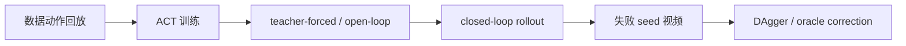

<!-- Generated by the offline translation workflow.
Source: 16-专题组队学习/04-AMD-ROCm策略复刻专题/README_03_ACT_ROCm迁移与DAgger诊断.md
Source SHA-256: 01c702752e2e9fafb42423fd886a3e7ebb5781ed63ad6b4d5cd68a63bc181fc6
Model: tencent/Hy-MT2-1.8B-GGUF:Q4_K_M
Review machine-translated technical claims before relying on them.
-->
# 03 ACT Migration and DAgger Diagnosis on ROCm

This task focuses on ACT. The decrease in loss on the training set does not necessarily indicate a successful closed loop deployment. Especially when replicating on ROCm devices, it is necessary to first prove that failures are not caused by the environment, data, memory, or success criteria before discussing the model structure and data policy.

Supporting practical notebook: [03_act_dagger_diagnostics.ipynb](../../../16-专题组队学习/04-AMD-ROCm策略复刻专题/notebooks/03_act_dagger_diagnostics.ipynb).

## First, look at the conclusion

When learning, remember the following three points first; there is no need to distinguish many evaluation groups:

| Model | Current review results | Learning focus |
| --- | --- | --- |
| SmolVLA | `57/60` (red cup `27/30`, blue cup `30/30`) | Main case: First observe successful playback, then learn training and evaluation |
| Pi0 | `12/14`; unobserved positions `9/10`, hard group `6/8` | Advanced case: Learn large model permissions, action alignment, and failure diagnosis |
| ACT | Current protection candidate `15/30`; historical tutorial reference `17/30` | Diagnosis case: Learn closed loop distribution deviation, DaggerG, and strict success判定 |

The `15/30` here is the reproduction result of the protection candidate already completed on AMD395; the same native training recipe has been written into the Notebook, but it still needs to be actually executed from scratch in an environment with a Jupyter kernel, so that this score can be called “Notebook-native reproduction”. Therefore, the tutorial will present both the executable recipe and the audit results separately, without mixing them up.

## ACT Diagnosis Route

It is recommended to check in the following order:



The questions answered at each step are different:

| Step | Question Answered |
| --- | --- |
| Data Action Reproduction | Whether collecting data alone can complete the task |
| ACT Training | Whether the model can learn offline action distributions |
| Open-Loop | Whether the model can reproduce a trajectory based on data states |
| Closed-Loop | Whether the policy remains stable when running autonomously |
| Failure Video | Whether the failure occurs during approach, grasping, handling, or release |
| DAgger | How to restore the state after a closed loop deviation |

## Common ACT Failure Types

| Failure Type | Phenomenon | Possible Causes |
| --- | --- | --- |
| No contact with cup | Gripper remains near the cup | Insufficient image conditions, initial pose OOD, closed loop offset |
| Can lift but fails to release | Cup suspended on plate or moved away | Gripper tag, too short tail section release |
| Placed at edge of plate but cup spills | Position close but pose failure | Insufficient end-stage teaching, unstable placement height |
| Open-loop successful, closed-loop failed | Works in data mode, fails on its own | Closed loop distribution offset |

## How to collect DAgger data

A suitable DAgger process for teaching:

1. Reset the reset-start baseline for training;
2. Fix a set of seeds for a closed loop rollout;
3. Identify the failed seeds;
4. Run the current policy for several steps ahead, such as 40 control ticks;
5. Switch to the oracle or scripted policy from the state near the failure point;
6. Save the correction suffix;
7. Record the source, timestamp offset, and sampling weight when merging data;
8. Retrain and evaluate using the same set of seeds.

Note: The amount of correction data is not necessarily more is better. Directly mixing high-weight data from full-reset failure-bucket into the main training may disrupt the already learned reset-start behavior.

## What Did the Current ACT Change?

The old tutorial summary recorded `17/30`. The current repair15 protection candidate has reached `15/30` under the same strict protocol, but the historical data 17/30 has not been fully restored yet. W7900 normal ACT is `0/30`, AMD395 stable61 fallback is `7/30`, and the old protected DAgger artifact is `2/30`. The original closed-loop baseline for ACT can hardly be determined by strict physical success, and subsequent diagnostics still come from a series of revisable changes.

Step one is to tighten the evaluation criteria. The old `success` only considered the geometric conditions of the environment, which might misclassify actions such as pushing, squeezing, and pouring as successful. This special report follows the `physical_success` standard: the cup must be lifted and moved onto the plate, and in the final state, it should be basically upright. Without this step, subsequent training adjustments can easily be misled by the old metrics.

The second step is to separate failures into open-loop and closed-loop scenarios. We generate ACT actions using the dataset observation, and then place these actions back into MuJoCo in an open-loop manner. This diagnosis helps distinguish two aspects: whether the model has learned the actions based on the data state, and whether the policy fails due to state drift during its closed loop execution. The results show that under single demo or clean data conditions, ACT sometimes has near-usable arm trajectory, but the gripper release is very short, and the closed loop distribution deviation is also significant. Therefore, solving the problem cannot rely solely on adjusting the gripper or continuing training.

The third step is to redo the reset-aligned data. In the old data, many episodes do not start from the evaluation reset posture. During training, the loss appears normal, but the closed-loop does not touch the cup when starting from the reset position. The subsequent main pipeline is changed to a reset-aligned scripted oracle: each trajectory starts from the reset state used during evaluation, ensuring that the data can be played back successfully according to the same physical standard.

Step 4 is to adjust the ACT training configuration. In the final main line, use no-VAE, `chunk_size=20`, `n_action_steps=10`, timestamp state, `obj_init` state, gripper BCE `0.5`, and per-episode early weight. Each of these items corresponds to a failure phenomenon:

| Changes | Problems Solved |
| --- | --- |
| no-VAE | Reduces sampling randomness under small data, making replication more stable |
| timestamp state | Explicitly assigns time phase to the model, preventing all stages from being averaged together |
| `obj_init` state | Ensures the model knows the initial geometric relationship between cups and plates in this round |
| gripper BCE `0.5` | Strengthens the opening and closing sequence of the gripper, without excessively sacrificing the arm trajectory |
| per-episode early weight | Protects the early segment before reset-start for each episode, preventing correction data from overwriting initial behavior |
| `n_action_steps=10` | Preserves the coherence of the chunk while reducing closed loop drift caused by overly long execution times |

Step five is prefix40 DAgger. Have the current ACT run 40 control ticks first, then switch to the scripted oracle to take over and save the suffix. In this way, what is captured is the "state after the policy deviates", which is closer to the closed-loop failure distribution than just using a perfect reset-start teaching.

The sixth step is to add a timestamp offset for the correction episode. The prefix40 suffix is not a complete task starting from reset; if its timestamp also starts from 0, the model will mistake the "intermediate correction action" for the "task start action". Therefore, `timestamp offset = 2.0` is used for correction episodes to separate the time phase from the reset-start episode.

Step 7 is to weight down the correction data. We have tried different weights:

| Correction sampling weight | Strict result | Conclusion |
| --- | --- | --- |
| `0.1` | 1/15 | The correction data is too weak; the release/landing capability cannot compensate |
| `0.5` | 0/15 | The correction data is too strong, which disrupts the reset-start main distribution |
| `0.25` | 13/30 | The best compromise at that time |

Finally, use the best025 checkpoint to perform another round of prefix40 DAgger v1 on the failed seed, obtaining 3 valid correction trajectories. Then continue training by merging using timestamp offset `2.0` and sample weight `0.25`, resulting in the old protected DAgger checkpoint. Its current exact review is `2/30`. Subsequently, starting from the stable61 fallback protection weights, use the same correction data to perform a 2500-step continuation with low learning rate and no memory leakage, yielding the current repair15 protection candidate:

```text
ckpt/act_scripted_reset_oracle_plus_prefix40_dagger_best025_toffset2_downweight025_chunk20_n10_novae_gpu_5000_20260629_031208/step_5000
```

```text
AMD395 protected/act_stable61_to_dagger_nomemleak_step1500_strict15of30
physical_success = 15/30
fixed_seed_groups = 3 组，每组 10 条
```

In the fixed three-panel evaluation, stable61/step2500 on AMD395 is `7/30`, protected DAgger is `2/30`, and repair15 is `15/30`. Expert restoration data collection yielded `17/40` qualified trajectory records; this value describes the data collection quality, and the policy results are uniformly based on the `physical_success` used in the subsequent closed loop evaluation.

[`notebooks/16_act_end_to_end.ipynb`](../../../16-Special Team Learning/04-AMD-ROCm Policy Replication Topic/notebooks/16_act_end_to_end.ipynb) contains the same protection training recipe: data packaging, trajectory weighted sampling, no-VAE, gripper BCE, tqdm, checkpoint, and strict evaluation. During runtime, set `ACT_RECIPE=repair15`, and use the same output directory for training and evaluation.

## What to record on ROCm

ACT training usually does not require a high memory usage, but it is still necessary to record:

- batch size;
- chunk size;
- `n_action_steps`;
- whether no-VAE;
- whether there is gripper-assisted loss;
- training temperature;
- VRAM usage;
- whether kernel crash/OOM occurs.

If training fails, first use the device logs to determine whether it is a hardware or ROCm issue; if training is stable but the policy fails, prioritize returning to data and closed loop diagnosis.

## Closed Loop Diagnosis Results

The clean closed-loop baseline is `0/10`. After adding the timestamp offset, downweight correction, and DAgger data, stable61 becomes `7/30`, protected DAgger becomes `2/30`, and repair15 continuation becomes `15/30`. The three fixed panels obtain `3/10`, `4/10`, and `8/10` respectively.


Figure 1: Variation in the physical success rate of the ACT closed loop over diagnostic steps. The improvement here comes from data and closed loop state correction, not simply by extending training time.

| Stage | Physical Success | Explanation |
| --- | --- | --- |
| Clean Closed Loop | 0/10 | The model cannot achieve stable contact and handle the cup in a closed loop state |
| Timestamp Offset | 3/15 | Action alignment improved some parts of the trajectory, but it remains unstable |
| Downweight DAgger | 13/30 | Correction data begins to capture states near failures |
| Stable61 Fallback | 7/30 | Old baseline |
| Protected DAgger Artifact | 2/30 | Exact result of the old protected directory |
| Repair15 Protected Candidate | 15/30 | Current best; ten samples per group of three fixed seeds, with grouping result `3/10 + 4/10 + 8/10` |


Figure 2: ACT DAgger physical success rollout, used to observe grasping, handling, and release stages.


Figure 3: Typical failure scenario of ACT best DAgger. Even if the environmental geometry occasionally approaches success, continue to check the lift height and final posture.

## Checkpoint

After completing this task, organize these items:

| Item | Content |
| --- | --- |
| ACT checkpoint | Represented by a variable for the path |
| Open-loop success rate | Training set or fixed seed |
| Closed-loop success rate | Using `physical_success` |
| DAgger data description | Prefix length, oracle type, sampling weights |
| Typical failure videos | At least 1 |
| Next decision | Continue DAgger / Repair gripper / Re-teach / Adjust chunk |
